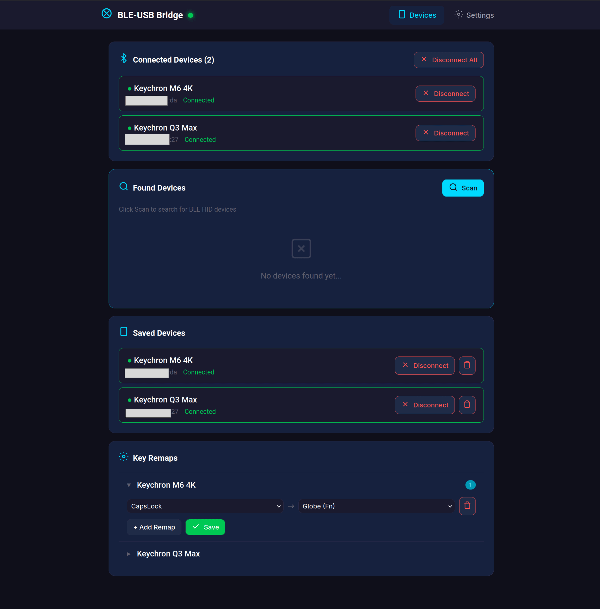
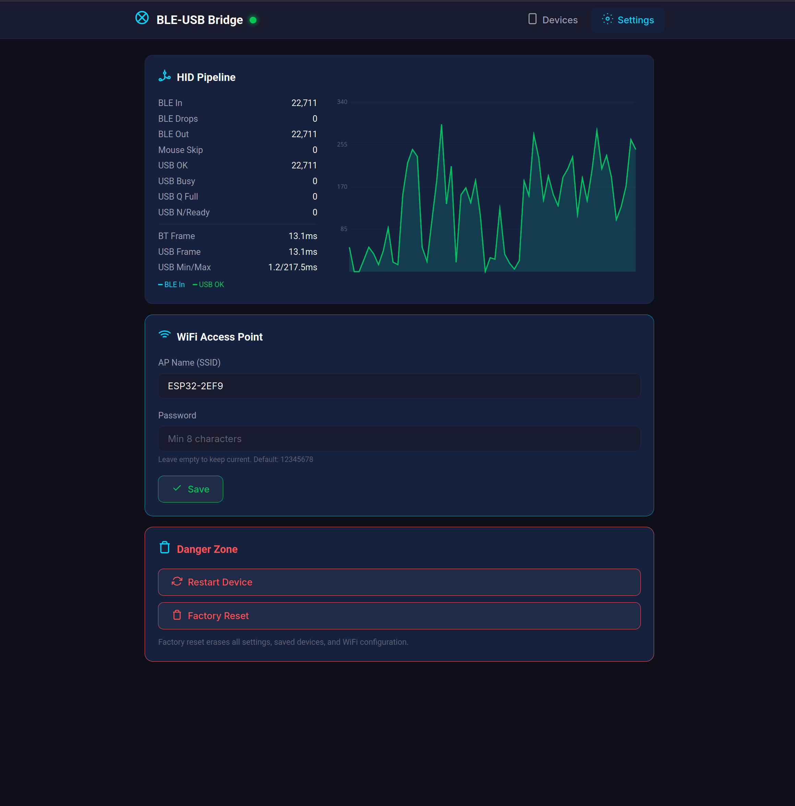

# BLE-USB HID Bridge

ESP32-S3 firmware that bridges Bluetooth Low Energy HID devices (mice, keyboards) to USB. Connect up to 4 BLE peripherals simultaneously and use them with any USB host — no drivers, no pairing on the host side.

Built on ESP-IDF + FreeRTOS. Target board: **Waveshare ESP32-S3 Zero** (or any ESP32-S3 with native USB).

## Screenshots

| Devices | Settings |
|---------|----------|
|  |  |

## Features

- **Multi-device BLE**: Connect up to 4 BLE HID devices at once
- **Auto-reconnect**: Saved devices reconnect automatically when in range
- **Dynamic HID parsing**: Parses any standard HID Report Map — works with arbitrary mice, keyboards, media controllers
- **Key remapping**: Per-device key remaps with keyboard, modifier, and consumer code targets
- **Mouse interpolation**: Optional smoothing — splits large BLE deltas into multiple USB sub-frames
- **Web UI**: WiFi AP with responsive Vue 3 interface for device management, stats, and configuration
- **Headless operation**: Button-driven pairing (triple-click), WiFi toggle (double-click), factory reset (hold)
- **NeoPixel status LED**: Color-coded system state at a glance
- **Pipeline diagnostics**: Real-time BLE/USB frame timing, throughput counters, and live chart

## Hardware

| Component | Details |
|-----------|---------|
| Board | Waveshare ESP32-S3 Zero (ESP32-S3, 4MB flash, native USB) |
| LED | WS2812 NeoPixel on GPIO 21 |
| Button | BOOT button on GPIO 0 |
| USB | Native USB-OTG (TinyUSB, Full Speed) |
| BLE | Bluedroid stack, BLE 4.2+ |
| WiFi | 2.4GHz AP mode for configuration |

## Quick Start

```bash
# Build
make

# Build and flash
make upload

# Serial monitor
make monitor

# Debug build (verbose logging)
make ENV=esp32s3_zero_dev
```

### Prerequisites

1. Install [PlatformIO Core](https://docs.platformio.org/en/latest/core/installation/index.html) (CLI or VS Code extension).

2. After the first `make` (or `pio run`), PlatformIO downloads the ESP-IDF toolchain automatically. Then install the required Python packages into the ESP-IDF virtualenv:

```bash
# Path to the ESP-IDF venv created by PlatformIO
ESPIDF_VENV=~/.platformio/penv/.espidf-5.5.3
ESPIDF_PKG=~/.platformio/packages/framework-espidf

$ESPIDF_VENV/bin/pip install \
    idf-component-manager \
    esp-idf-kconfig \
    -r $ESPIDF_PKG/tools/requirements/requirements.core.txt
```

> These packages are only needed once per machine. If you see errors like
> `No module named 'idf_component_manager'` or `No module named kconfgen`,
> re-run the commands above.

## Usage

### First Boot

1. Flash the firmware. The LED fades purple (idle).
2. **Triple-click** the button — LED fades cyan, the bridge scans and auto-connects the first BLE HID device found.
3. The LED turns solid green when connected. Mouse/keyboard input flows to USB immediately.

### Web UI

1. **Double-click** the button to enable WiFi. LED blinks blue.
2. Connect to the `ESP32-S3-AP` network (password: `12345678`).
3. Open `http://192.168.4.1` in a browser.

From the web UI you can:
- Scan for BLE devices and connect/disconnect
- Manage saved devices (auto-reconnect list)
- Configure per-device key remaps
- Monitor HID pipeline statistics and frame timing
- Change WiFi AP name and password
- Restart or factory reset the device

### Button Controls

| Action | Function |
|--------|----------|
| Double-click | Toggle WiFi AP + Web Server |
| Triple-click | Headless BLE pairing |
| Hold 5s | Factory reset warning (LED blinks red) |
| Hold 25s | Factory reset (erases all settings, reboots) |
| Release during warning | Cancel factory reset |

### LED Indicators

| Color | Pattern | Meaning |
|-------|---------|---------|
| Purple | Fade | Idle, no connections |
| Cyan | Fade | BLE pairing in progress |
| Blue | Blink | WiFi AP active |
| Green | Solid | BLE device connected |
| Red | Blink | Factory reset warning |

## Architecture

### Dual-Core Design

```
Core 0 (networking + UI)              Core 1 (realtime HID pipeline)
  WiFi AP                               Bluedroid (BTC callbacks)
  Web Server (httpd)                     HidBridge task
  LED + Button tasks                     TinyUSB task
```

Core 1 is dedicated — nothing else runs there. The NOTIFY ring buffer between BTC callbacks and HidBridge requires no mutex because both execute on the same core.

### Data Flow

```
BLE Peripheral
  | NOTIFY callback (Core 1)
  v
Ring Buffer (lock-free, single-core)
  | xTaskNotifyGive → instant wakeup
  v
HidBridge::run()
  | BleConnection: parse HID report map, extract fields
  | KeyRemapManager: apply per-device remaps
  v
UsbHid::sendMouse / sendKeyboard / sendConsumer
  | ring buffer
  v
UsbHid::processOne() — 1ms USB frame pacing
  |
  v
USB Host PC
```

### Cross-Core Communication

Web Server (Core 0) and HidBridge (Core 1) communicate exclusively via FreeRTOS queues:
- **cmd_queue**: Commands from Web/Button → HidBridge (connect, disconnect, scan, set remaps)
- **event_queue**: BLE events from HidBridge → WebServer (device found, connected, disconnected)

### BLE Connection State Machine

```
IDLE → CONNECTING → DISCOVERING_SVC → READING_REPORT_MAP →
  DISCOVERING_CHARS → REGISTERING_NOTIFY → READY
```

Security levels are tried adaptively: HIGH → MEDIUM → LOW → NONE. The working level is persisted per device.

## USB HID Reports

| Report ID | Type | Fields |
|-----------|------|--------|
| 1 | Mouse | 5 buttons, X/Y (8-bit relative), wheel, horizontal wheel |
| 2 | Keyboard | 8 modifiers + 6 simultaneous keycodes |
| 3 | Consumer | 16-bit usage code (media keys, volume, etc.) |

## Configuration

All tunables live in `src/config.h` with override support via `-D` build flags in `platformio.ini`.

### Key Settings

| Setting | Default | Description |
|---------|---------|-------------|
| `BLE_CONN_MIN_INTERVAL` | 6 (7.5ms) | Fastest BLE connection interval |
| `BLE_RECONNECT_SEC` | 5 | Auto-reconnect scan interval |
| `BLE_MAX_FOUND_DEVICES` | 16 | Max tracked scan results |
| `USB_SEND_QUEUE_SIZE` | 64 | USB report ring buffer depth |
| `HID_MOUSE_INTERP` | 0 | Mouse interpolation (0=off, 1=on) |
| `HID_MOUSE_INTERP_STEPS` | 3 | USB sub-frames per BLE report |
| `MAX_KEY_REMAPS` | 32 | Max remap entries per device |
| `WIFI_AP_SSID` | "ESP32-S3-AP" | WiFi AP name |
| `WIFI_AP_PASSWORD` | "12345678" | WiFi AP password |
| `DEV_LOGS` | 0 | Debug logging (1=verbose) |

## Project Structure

```
src/
  config.h              All compile-time configuration
  main.cpp              Task creation and button handler
  usb_hid_api.h/.cpp    TinyUSB HID wrapper (ring buffer + frame pacing)
  tasks/
    hid_bridge.h/.cpp   BLE host + USB output orchestrator
    web_server.h/.cpp    HTTP server + API handlers
    led.h/.cpp           NeoPixel WS2812 driver (RMT)
    button.h/.cpp        Debounced button with multi-gesture detection
    wifi.h/.cpp          WiFi AP management
    ble/
      ble_connection.*   Per-device BLE state machine
      hid_parser.*       HID Report Map parser
      key_remap.*        Per-device key remap manager
include/
  task_base.h           Abstract base class for all tasks
  storage.h             Thread-safe NVS key-value storage
web/
  app.js                Vue 3 application logic
  styles.css            UI styling (dark/light mode)
  components/*.html     SFC-like Vue components
  build.py              Assembles web UI → gzipped C header
```

## Build Environments

| Environment | Board | Debug |
|-------------|-------|-------|
| `esp32s3_zero` | ESP32-S3-DevKitM-1 | Release |
| `esp32s3_zero_dev` | ESP32-S3-DevKitM-1 | Debug (`DEV_LOGS=1`) |
